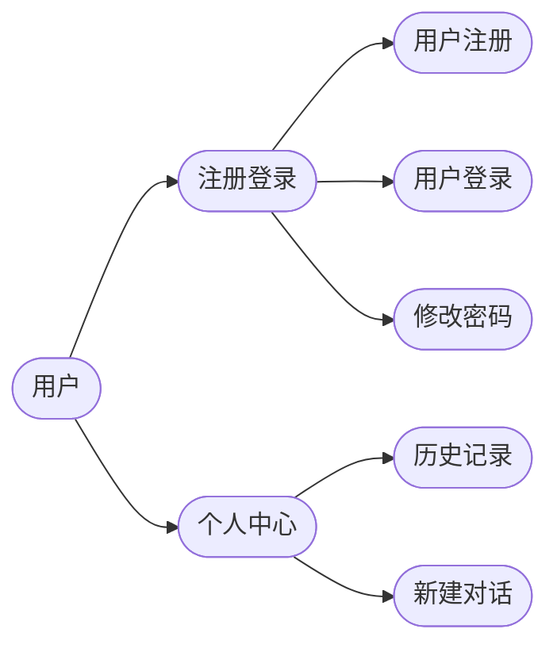
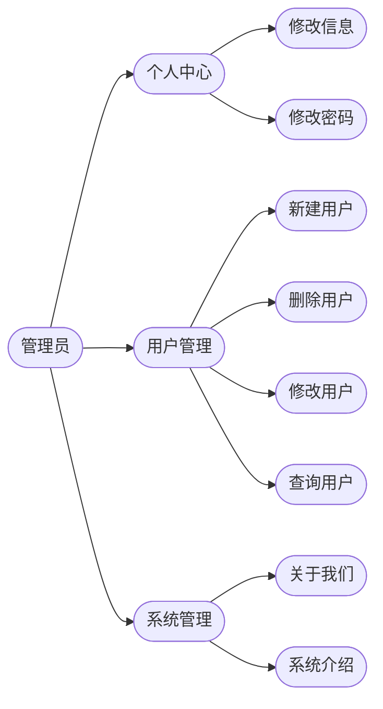
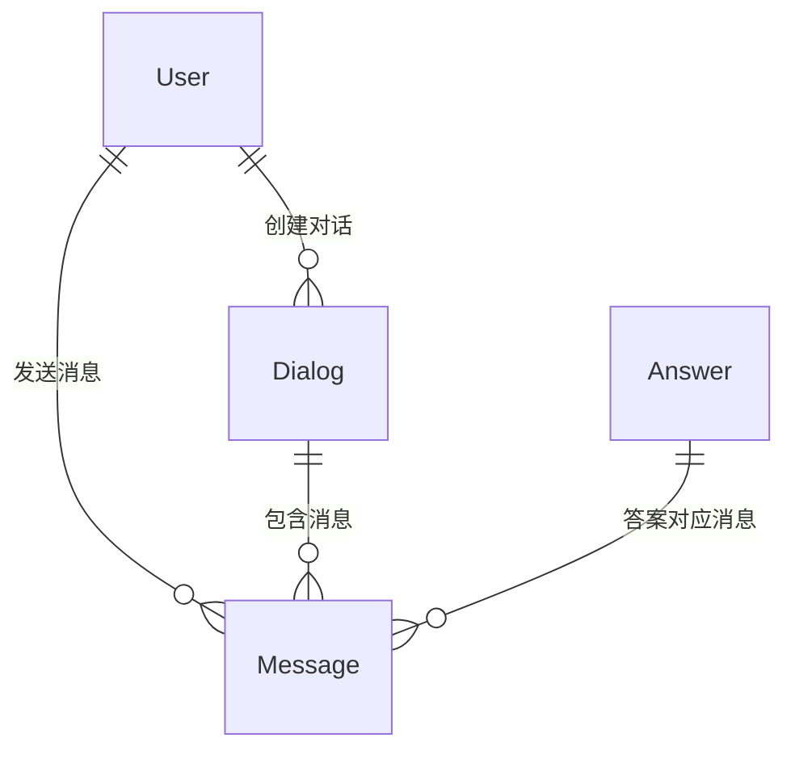

# 项目文档

## 1. 用户模块

用户模块的基本功能如下：

管理员模块的基本功能如下：

## 2. 实体关系

E-R 图如图所示，包含一定的冗余设计：

## 3. 接口设计

### 3.1 用户模块

- `POST /users/register`：用户注册
- `POST /users/login`：用户登录
- `POST /users/logout`：用户登出
- `POST /users/change_password`：修改密码
- `POST /users/change_info`：修改个人信息
- `GET /users/{user_id}/dialogs`：获取用户对话列表

### 3.2 对话

- `GET /dialogs/{dialog_id}`：获取对话详情
- `POST /dialogs/create`：新建对话
- `POST /dialogs/{dialog_id}/send_message`：发送消息
